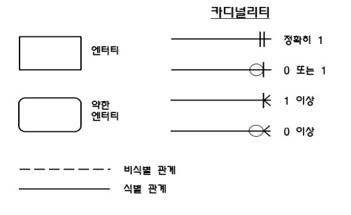

## 데이터 모델링의 이해

### 데이터 모델링 개념

#### 데이터 모델링의 중요성 및 유의점

- 중복 : 같은 시간 같은 데이터 제공 
- 비유연성 : 사소한 업무변화에 데이터 모델이 수시로 변경되면 안됨. 데이터 정의를 사용 프로세스와 분리한다. 
- 비일관성 : 데이터 간 상호 연관 관계에 대해 명확히 정의해야 한다. 

#### 데이터 모델링 종류

- 개념적 모델링 
  - 복잡하게 표현하지 않고 중요한 부분들 , 업무적 관점에서 모델링, 기술적 용어 사용 X ,
  - 엔터티와 속성을 도출하고 개념적 ERD 생성
- 논리적 모델링
  - 식별자를 도출하고 필요한 모든 릴레이션을 정의한다.
  - 정규화를 수행해서 데이터 모델의 독립성을 확보한다. 

- 물리적 모델링
  - 데이터베이스를 실제 구축한다. (테이블, 인덱스, 함수)

#### 데이터 모델링 특징 

- 추상화 : 현실세계를 간략하게 표현한다.
- 단순화 : 누구나 쉽게 이해하게 표현
- 명확성 : 명확하게 의미가 해석되어야 하고 한가지 의미를 가져야 한다.

#### 데이터 모델 요소

- 어떤 것
- 속성
- 관계

#### 좋은 데이터 모델의 요소

- 완전성 : 업무에 필요한 모든 데이터가 모델에 정의
- 중복배제 : 하나의 DB내에 동일한 사실은 한번만
- 업무규칙 : 많은 규칙을 사용자가 공유하도록 제공
- 데이터 재사용 : 데이터가 독립적으로 설계돼야 함
- 의사소통 : 업무규칙은 엔터티, 서브타입, 속성, 관계 등의 형태로 최대한 자세히 표현
- 통합성 : 동일한 데이터는 한 번만 정의. 참조 활용

### 데이터 독립성

#### 데이터 독립성 요소

- 외부 스키마 : 개개인 사용자가 보는 개인적 DB 스키마  , 응용 프로그램이 접근하는 데이터베이스
- 개념 스키마 : 모든 사용자 관점을 통합한 전체 DB , 설계자 관점
- 내부 스키마 : 물리적 장치에서 데이터가 실제적으로 저장되는 구조 , 개발자 관점 

#### 데이터의 독립성

- 논리적 독립성 : 개념스키마 변경 , 외부 스키마에 영향 X 
  - Mapping(사상) : 외부 스키마 & 개념 스키마 연결
- 물리적 독립성 : 내부스키마 변경, 외부/개념스키마에 영향 X 
  - Mapping(사상) : 개념 스키마 & 내부 스키마 연결 

### ERD

#### 엔터티 개념

- 업무에 필요하고 유용한 정보를 저장하고 관리하기 위한 집합적인 것

#### 엔터티 특징

1. 반드시 해당 업무에서 필요하고 관리
2. 유일한 식별자에 의해 식별 가능
3. 두 개 이상의 인스턴스의 집합
4. 업무 프로세스에 의해 이용되어야 함
5. 반드시 속성이 있어야 함
6. 다른 엔터티와 최소 1개 이상의 관계가 있어야 함(통계성/코드성 엔터티는 관계 생략 가능)

#### 엔터티의 분류

- 유무형에 따른 분류 
  - 유형 : 물리적 형태 ex) 사원, 물품, 강사
  - 개념 : 개념적 정보 ex) 조직, 보험상품
  - 사건 : 업무 수행시 발생 ex) 주문, 청수, 미납
- 발생 시점에 따른 분류
  - 기본 : 그 업무에 원래 존재하는 정보, 타 엔터티의 부모 역할, 자신의 고유한 주식별자를 가짐 ex) 사원, 부서
  - 중심 : 기본 엔터티로부터 발생, 다른 엔터티와의 관계로 많은 행위 엔터티 생성 ex) 계약, 사고, 주문
  - 행위 : 2개 이상의 부모 엔터티로부터 발생, 자주 바뀌거나 양이 증가 ex) 주문목록, 사원변경이력 

#### 엔터티의 명명

- 현업업무에서 사용하는 용어 사용, 약어 사용금지, 단수명사 사용, 고유한 이름 사용, 생성의미대로 부여

#### ERD 작업순서

1. 엔터티를 그린다.
2. 엔터티를 배치한다.
3. 엔터티 관계를 설정한다.
4. 관계명을 기술한다. 
5. 관계의 참여도 기술한다.
6. 관계필수여부를 표현한다.

#### 속성

- 업무에서 필요로 하는 인스턴스로 관리하고자하는 의미상 분리되지 않는 최소의 데이터 단위 

#### 엔터티, 속성의 특징

- 한 개의 엔터티는 2개 이상의 인스턴스 집합
- 한 개의 엔터티는 2개 이상의 속성을 가짐
- 한 개의 속성은 1개의 속성값을 가짐 

 #### 속성의 분류

- 특성에 따른 분류
  - 기본 : 업무로부터 추출한 모든 일반적인 속성
  - 설계 : 업무를 규칙화하기 위해 새로 만들거나 변형, 정의하는 속성 ex) 일련번호
  - 파생 : 다른 속성에 영향을 받아 발생하는 속성, 적을수록 좋음 ex) 합
- 분해 여부에 따른 분류 
  - 단일 : 하나의 의미로 구성됨 ex) 회원ID, 이름
  - 복합 : 여러개의 의미가 있는 것으로 ex) 주소 cause 시, 군 , 동으로 분해 가능
  - 다중값 : 속성에 여러 개의 값을 가질 수 있는 것으로 ex) 상품 리스트 , 엔터티로 분해 가능 

#### 도메인

- 속성에 대한 데이터타입, 크기, 제약사항 지정 

#### 속성의 명명

- 해당 업무에서 사용하는 이름
- 서술식 속성명 사용 금지
- 약어 사용 금지
- 구체적으로 명명하여 유일성 확보

### 관계 

- 엔터티의 인스턴스 사이의 논리적인 연관성으 로서 존재의 형태로서나 행위로서 서로에게 연관성이
  부여된 상태 관계 , 페어링의 집합
  ex) - ( ) - 강사 가르친다 관계 수강생

#### 관계의 종류

- 존재 관계 : 엔터티 간의 상태를 의미한다. ex) 고객 은행 회원가입, 관리점이 할당 (관리점 << 고객 소속됨)
- 행위 관계 : 엔터티 간에 어떤 행위가 있는 것을 의미한다. ex) 계좌를 사용해서 주문을 발주하는 관계 

#### 패어링  

- 엔터티 안에 인스턴스가 개별적으로 관계를가지는 것

#### UML( ) 통합모델링언어 에서의 관계
- 연관관계  (실선) : 항상 이용하는 관계 ex)  소속된다.
- 의존관계  (점선) : 상대 행위에 의해 발생하는 관계 ex) 주문한다.

#### 관계의 표기법
- 관계명 : 관계의 이름
- 관계차수 : 1:1, 1:M, M:N
- 관계선택성 (관계선택사양) 
  - 필수관계 : 반드시 하나가 있어야 하는 관계 ex) 고객이 있어야 계좌 존재 가능
  - 선택관계 : 없을 수도 있는 관계 

### 식별자

- 엔터니 내에서 인스턴스를 구분하는 구분자 
- 식별자는 논리적 데이터 모델링 단계에서 사용
- Key는 물리적 데이터 모델링 단계에서 사용

#### 주식별자의 특징

- 유일성 : 주식별자에 의해 모든 인스턴스들이 유일하게 구분
- 최소성 : 주식별자를 구성하는 속서으이 수는 유일성을 만족하는 최소의 수가 되어야 함
- 불변성 : 지정된 주식별자의 값은 자주 변하지 않아야 함. (변하면 이전 기록 말소됨)
- 존재성 : 주식별자가 지정되면 반드시 값이 들어와야 함

#### 식별자의 분류

- 대표성 여부 
  - 주식별자 : 엔터티를 대표하는 식별자, 다른 엔터티와 참조 관계로 연결될 수 있다.
  - 보조 식별자 : 유일성과 최소성은 만족하지만 대표성을 만족하지 못하는 식별자, 참조관계 연결 X
- 스스로 생성 여부
  - 내부 : 스스로 생성되는 식별자
  - 외부 : 타 엔터티로부터 받아오는 식별자
- 속성의 수
  - 단일 : 하나의 속성으로 구성
  - 복합 : 타 엔터티로부터 받아오는 식별자
- 대체 여부
  - 본질 : 업무에 의해 자연스럽게 만들어지는 식별자
  - 인조 : 인위적으로 마든 식별자 

#### 식별자 관계

- 주식별자 

  - 자식의 주식별자로 부모의 주식별자 상속
  - 부모로부터 받은 식ㅈ별자를 자식 엔티터의 주식별자로 이용하는 경우 : 강한 연결관계, 실선 표기

- 비식별자

  - 부모 속성을 자식의 일반 속성으로 사용
  - 점선으로 표현 

  

## 데이터 모델과 성능

#### 성능 데이터 모델링

- DB 성능향상을 목적으로 설계
- 단계의 데이터 모델링 때부터 정규화 반정규화 테이블통합 테이블분할 조인구조 등 , , , PK, FK 여러 가지성능과 관련된 사항이 데이터 모델링에 반영될 수 있도록 하는 것

- 분석 설계 / 단계에서 데이터 모델에 성능을 고려한 데이터 모델링을 수행할 경우 성능저하에 따른 재업무 비용을 최소화 할 수 있음.
- 데이터의 증가가 빠를수록 성능저하에 따른 성능개선 비용은 기하급수적으로 증가하게 된다.

#### 함수적 종속성 

- 데이터들이 어떤 기준 값에 의해 종속되는 현상

### 분산 DB

- 여러 곳으로 분산되어있는 DB를 하나의 가상 시스템으로 사용할 수 있도록 한 DB
- 논리적으로 동일한 시스템에 속하지만 컴퓨터 , 네트워크를 통해 물리적으로 분산되어 있는 데이터집합

#### 분산 DB를 만족하기 위한 6가지 투명성

- 분할 투명성 단편화 
  - 하나의 논리적 Relation이 여러 단편으로 분할되어 각 사본이 여러 시스템에 저장

- 위치 투명성
  - 사용하려는 데이터의 저장 장소 명시 불필요 (어느 위치에 있더라도 동일한 명령사용)
- 지역사상 투명성 
  - 지역 DBMS와 물리적 DB 사이의 Mapping 보장
- 중복 투명성 
  - DB 객체가 여러 시스템에 중복되어 존재함에도 데이터의 일관성 유지
- 장애 투명성 
  - 각 지역의 시스템이나 통신망에 이상이 발생해도, 데이터의 무결성은 보장된다. (원자성 유지)
- 병행 투명성
  - 다수 트랜잭션 동시 수행시 결과의 일관성 유지

#### 분산 DB 장, 단점

- 장점
  - 지역 자치성
  - 데이터 베이스 신뢰성, 가용성
  - 병렬 처리로 인한 빠른 응답
  - 용량 확장이 쉬움
  - 비용 절감 
- 단점
  - 관리와 통제가 어렵다. (여러 네트웨크를 통해서 분리됨)
  - 보안관리가 어렵다.
  - 무결성 관리가 어렵다.
  - 설계가 복잡하다.

### 정규화

- 반복적인 데이터를 분리하고 각 데이터가 종속된 테이블에 적절하게 배치되도록 하는 것

- 이상현상(불필요한 데이터를 추가하거나 정보가 없어서 추가가 불가능한 현상)을 해결하기 위해 테이블 분해

#### 정규화 절차

- 1차 정규화 : 같은 성격 내용 컬럼이 연속될 때 컬럼 제거 테이블 , 생성 (속성의 원장성 확보, PK설정) => 기본키 잡기 
- 2차 정규화 :  기본키가 2개이상의 속성으로 이루어질 때 발생 , 부분적 함수 종속성 제거 또는 분해 (테이블 분리)
- 3차 정규화 : 기본키를 제외한 칼럼 간에 종속성을 제거 (이행 함수 종속성 제거)

##### 정규화의 문제점 

- 새로운 관계 테이블 생성으로 조인이 부하를 유발 => 시스템의 성능향상과 개발과 운영의 단순화를 위해 중복, 통합 분리등을 수행하는 반정규화 사용

- 일반적으로 정규화시 입력 수정 삭제 성능이 향상되며 반정규화시 조인 성능이 향상된다.

### 반정규화

- 데이터베이스의 성능 향상을 위하여, 데이터 중복을 허용하고 조인을 줄이는 데이터베이스 성능 향상
- 조회 속도를 향상하지만, 모델의 유연성은 낮아진다. 
- 수행속도가 느려짐, 다량의 범위를 자주 처리, 특정 범위의 데이터만 자주 처리, 요약/집계 정보가 요구 => 반정규화 사용

#### 반정규화 절차

- 대상 조사 및 검토 
- 다른 방법 검토 
  - 반정규화를 수행하기 전 다른 방법 있는지 검토 (클러스터링, 뷰, 인덱스 튜닝, 응용프로그램, 파티션 등)
- 반정규화 수행

#### 반정규화 기법

- 계산된 칼럼 추가 
  - 알고리즘 혹은 배치 프로그램으로 결과를 미리 계산하고, 이를 특정 칼럼에 추가한다. 
- 테이블 수직분할
  - 하나의 테이블을 두 개 이상의 테이블로 분할한다.
- 테이블 수평분할
  - 하나의 테이블에 있는 값을 기준으로 테이블을 분할한다. 
- 테이블 병합
  - 1대1 관계 테이블은 하나의 테이블로 병합
  - 1대 N 관계 테이블 병합 => 많은 양의 데이터 중복 발생
  - 슈퍼 타입과 서브타입 관계 발생하면 테이블 통합 
    - 슈퍼/ 서브타입 모델 :  부모와 자식간의 관계 ex) 고객 엔터티 : 슈퍼타입 // 개인고객, 법인고객 : 서브 타입 

#### 반정규화 외의 기법

- 클러스터링 
  - 클러스터링 인덱스 : 인덱스 정보 저장할때 물리적으로 정렬 저장
  - 조회 시에 인접 블록을 연속적으로 읽어 성능 향상
- 파티션 기법
  - 논리적으로는 하나의 테이블이지만 여러개의 데이터 파일에 분산되어서 저장한다. 
  - Range : 데이터 값의 범위를 기준으로 파티션
  - List : 특정한 값을 지정하여 수행
  - Hash : 해시 함수를 적용
  - Composite : 범위와 해시를 복합적으로 사용

